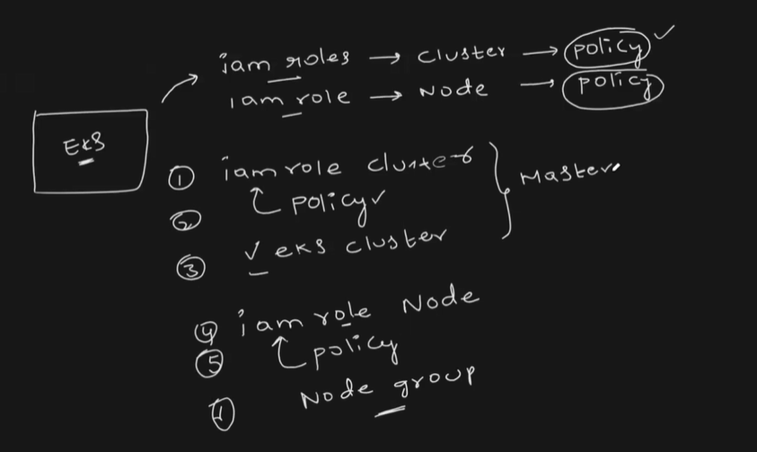

# 🚀 Steps to Create an EKS Module with Terraform

## 1. Create IAM Role for the EKS Cluster (Control Plane)
- Resource: `aws_iam_role`
- Attach policy: `AmazonEKSClusterPolicy` using `aws_iam_role_policy_attachment`
- Trust relationship with: `eks.amazonaws.com`

## 2. Create the EKS Cluster
- Resource: `aws_eks_cluster`
- Requires: `role_arn` from step 1 and a list of `subnet_ids` (at least 2 in different AZs)
- Use `depends_on` to wait for IAM role attachment

## 3. Create IAM Role for Node Group
- Resource: `aws_iam_role`
- Attach 3 policies:
- `AmazonEKSWorkerNodePolicy`
- `AmazonEKS_CNI_Policy`
- `AmazonEC2ContainerRegistryReadOnly`
- Trust relationship with: `ec2.amazonaws.com`

## 4. Create Node Groups
- Resource: `aws_eks_node_group`
- Link to the cluster from step 2 and the IAM role from step 3
- Provide:
- `instance_types`
- `capacity_type` (ON_DEMAND or SPOT)
- `scaling_config` (min, desired, max)
- `subnet_ids`

## 5. Define Input Variables in `variables.tf`
- Includes: `cluster_name`, `cluster_version`, `vpc_id`, `subnet_ids`, `node_groups`

## 6. Configure Values in `terraform.tfvars`
- Set specific values for cluster name, subnets, and node group configs

## 7. Deploy with Terraform
```bash
terraform init
terraform apply

