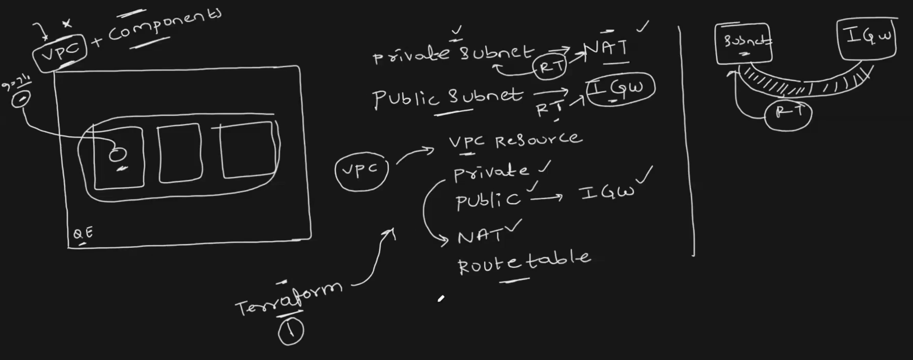

# 🧠 Tóm tắt sơ đồ hạ tầng VPC với Terraform

## 🏗 Các thành phần chính:
- VPC: mạng ảo trong AWS để chứa tất cả hạ tầng.

- Public Subnet:

- Có route ra Inte- rnet qua Internet Gateway (IGW).

- EC2 trong subnet này có thể truy cập và bị truy cập từ Internet.

- Private Subnet:

- Route đi Internet qua NAT Gateway (đặt trong Public Subnet).

- EC2 trong subnet này chỉ ra Internet, không nhận traffic từ ngoài.

- Route Table (RT): bảng định tuyến chỉ đường đi cho subnet.

- IGW: Cổng kết nối VPC ra Internet.

- NAT Gateway: Cho phép private subnet ra Internet mà vẫn giữ an toàn.

## 🔄 Luồng mạng:

Public Subnet → RT → IGW → Internet

Private Subnet → RT → NAT → IGW → Internet

## 🛠 Terraform sẽ tạo:
- VPC

- 2 loại Subnet: Public & Private

- Route Table cho từng loại

- IGW và NAT Gateway

- Gắn route table với từng subnet

